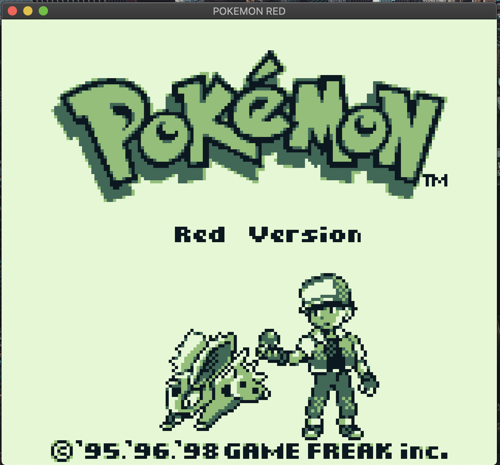
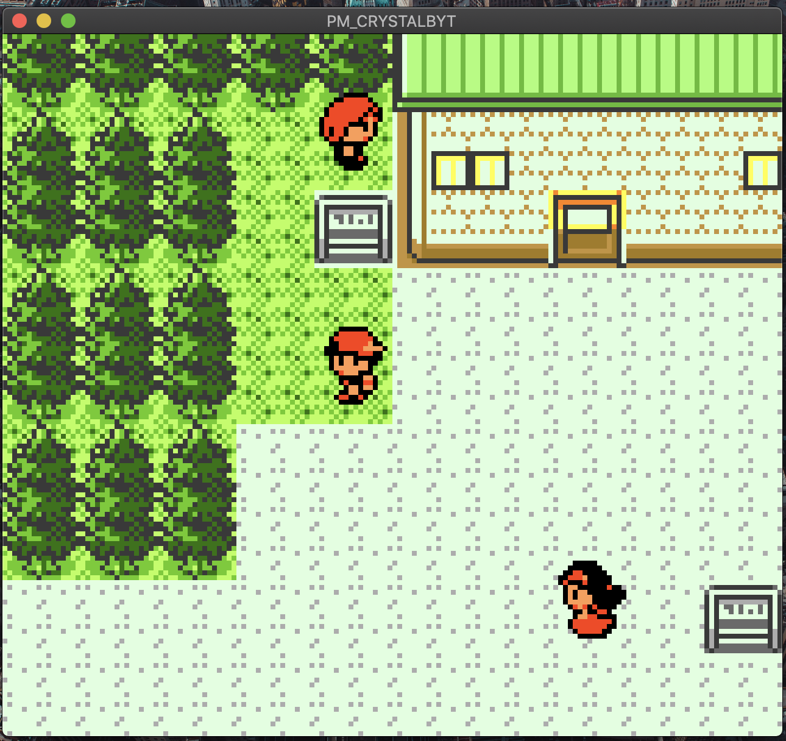

# Gameboy Emulator

A simple Gameboy and Gameboy Color emulator written in Rust with multi-platform support (Linux, Windows, macOS)

# Screenshots

## TODO

- [ ] Add Sound
- [ ] Controller Support
- [ ] Fast Forward
- [ ] Save States

## Acknowledgements

[This Gameboy emulator](https://github.com/gbdev/awesome-gbdev) repo helped a ton in addition to
[this guide on writing a GB emulator in Javascript](http://imrannazar.com/GameBoy-Emulation-in-JavaScript:-The-CPU)
and [this wiki](https://gbdev.gg8.se/wiki/articles/Main_Page)
